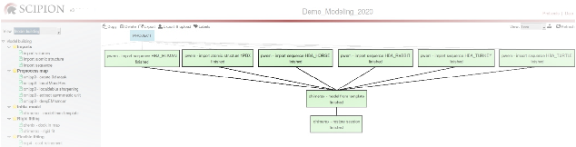

Moving from sequence to atomic structure scenario
=================================================

In this section we are going to obtain the initial *model* of our *target* sequence, in
this case the *Hgb* :math:`\alpha` subunit. To perform this task we are going
to use the *Scipion* protocol **chimerax-model from template**. Although this protocol offers several different
possibilities to get the right result (see Appendix :ref:`Model from template <app:modelFromTemplate>` for details and use cases), we are going to consider that we already have a *template*, that we have
found in the previous step and that will be used as protocol input. In
addition, although the protocol also allows to get a model including two
chains modeled simultaneously using the same *template* (multichain modeling), in
our example we are going to model only one chain, the *Hgb* :math:`\alpha`
subunit. :numref:`model_building_scipion_workflow_from_sequence` shows the workflow that we are going to detail in this section. Other possibilities of the protocol usage will be suggested at the end
of the chapter.

   *Scipion* framework detailing the workflow to generate the first model of the human *Hgb* :math:`\alpha` subunit.

Downloading the atomic structure
--------------------------------

Once identified the *template* that we are going to use as structural skeleton of
our sequence, we import it into *Scipion* with the protocol **import atomic structure** (see :numref:`model_building_import_atomic_structure` (1) and Appendix :ref:`Import atomic structure <app:importAtomicStructure>`). Select the option for importing the atomic structure from ID (2), write the *PDB*
accession code (3) and execute the protocol (4).

.. figure:: Images/Fig10.svg
   :alt: Importing the atomic structure *1PBX*.
   :name: model_building_import_atomic_structure
   :align: center
   :width: 100.0%

   Importing the atomic structure *1PBX*.

You can visualize the imported structure (5) in *ChimeraX* (:numref:`model_building_chimera_visualization_structure`). By selecting chain *A*
in the upper menu (1) you can distinguish the *Hgb* :math:`\alpha` subunit
(2).

.. figure:: Images/Fig11.svg
   :alt: Atomic structure *1PBX* visualized with :math:`ChimeraX`. *Hgb* :math:`\alpha` subunit (selected chain *A*) is shown green-highlighted.
   :name: model_building_chimera_visualization_structure
   :align: center
   :width: 80.0%

   Atomic structure *1PBX* visualized with :math:`ChimeraX`. *Hgb* :math:`\alpha`
   subunit (selected chain ) is shown green-highlighted.

Structural models of human *metHgb* subunits from templates
---------------------------------------------------------

*Modeller* :cite:p:`sali1993` is one of the computational web services
used by *ChimeraX*, which provides the interface to run the program. Working with *Modeller*
requires a license key, which is provided free of charge for academic
users. *Modeller* allows two types of modeling computations to generate theoretical
models, *template*-based (sequence homology) and *template*-free (*de novo*, only for missing
segments). In this tutorial we are going to consider the first one:
structure prediction by sequence homology. Requirements for this type of
modeling are the *template* structure and a sequence alignment including sequences
of *target* and *template*.

``NOTE before starting:`` We are going to use a *ChimeraX*-derived *Scipion* protocol for the first time in this
tutorial (**chimerax-model from template**, Appendix :ref:`Model from template <app:modelFromTemplate>`). Remark that this use of *ChimeraX* is completely different from the use of *ChimeraX* as a visualization tool,
as we have seen previously. By using the *ChimeraX* graphics window, opening it
from the *Scipion* button *Analyze Results* we can observe protocol results but we CANNOT save
anything. However, using *ChimeraX* as a tool, as it is the case in *Scipion* *ChimeraX*-derived
protocols, we can perform different tasks, taking advantage of the
available *ChimeraX* tools and, finally, we CAN save the obtained results and the
working session in *Scipion*.

-  | Preparing your sequence alignment:
   | In addition to the ways to obtain the sequence alignment using *ChimeraX*,
     this alignment can be also generated in the *Scipion* protocol **chimerax-model from template** (Appendix :ref:`Model from template <app:modelFromTemplate>`). This
     protocol allows selecting between pairwise and multiple sequence
     alignments. Besides producing more reliable alignments, especially
     for more distantly related sequences, multiple sequence alignments *(MSA)*
     provide more structural information than pairwise alignments; they
     locate conserved regions in the molecule, thus improving
     predictions of structural arrangements due to mutant residues or
     residues that differ between *template* and *target* sequences :cite:p:`pearson2013`. For this reason, in this tutorial
     we are going to perform a *MSA*.
     Additionally, you can also test the available tools to perform
     pairwise alignments.

   | Besides *target* and *template* sequences, other sequences are needed to accomplish a
     *MSA*. The type and number of the sequences
     included depends on the sequence conservation, although they have
     to allow differentiating conserved regions. As an example, our
     *MSA* will include four more *Hgb* :math:`\alpha`
     subunit sequences from organisms located between human and fish in
     the evolutionary scale: *Equus caballus* (Horse), *Oryctolagus cuniculus* (Rabbit), *Meleagris gallopavo* (Wild turkey), *Aldabrachelys gigantea* (Aldabra
     giant tortoise). Download these sequences one by one from *UniProtKB* database
     filling in the **import sequence** protocol form with the appropriate accession codes, *P01958*, *P01948*, *P01948*, and *P83134*, respectively (:numref:`model_building_multialignment_sequences`). A similar process has to be followed for *Hgb*
     :math:`\beta` subunit, importing *UniProtKB* sequences *P02062 (HBB HORSE)*, *P02057(HBB RABIT)*, *G1U9Q8 (G1U9Q8 MELGA)* and *P83133 (HBB ALDGI)*.

   .. figure:: Images/Fig12.svg
      :alt: Importing additional sequences to perform the *MSA*.
      :name: model_building_multialignment_sequences
      :align: center
      :width: 95.0%

      Importing additional sequences to perform the *MSA*.

-  | Access to *Modeller* in *ChimeraX*:
   | The protocol **chimerax-model from template** allows direct opening of the *MSA* in *ChimeraX* and then, access to *Modeller* via web service. Fill in the
     protocol form (:numref:`model_building_model_from_template_protocol` (1)), including the *template 1PBX*  previously imported (2), the
     particular chain of interest (use the wizard to select it (3)) and
     the *target* sequence of human *Hgb* :math:`\alpha` subunit (4). Since we plan to
     improve the alignment by including additional sequences to align
     (5), they will have to be added next (6). Finally, select one of
     the multiple sequence alignment tools (7).

   .. figure:: Images/Fig13.svg
      :alt: Importing the multiple sequence alignment in *ChimeraX*.
      :name: model_building_model_from_template_protocol
      :align: center
      :width: 100.0%

      Importing the multiple sequence alignment in *ChimeraX*.

   *ChimeraX* will be opened including this time the *MSA*
   together with the *ChimeraX* graphics window (:numref:`model_building_chimera_alignment`). The *template* selected chain is shown
   green-highlighted in both windows. As you may observe in the
   alignment, *Hgb* :math:`\alpha` subunit is a quite conserved macromolecule;
   there is only one gap in the alignment because *PRO* (Proline) 47 residue
   disappeared throughout the evolutionary process.

   .. figure:: Images/Fig14.svg
      :alt: Opening the multiple sequence alignment in *ChimeraX*.
      :name: model_building_chimera_alignment
      :align: center
      :width: 80.0%

      Opening the multiple sequence alignment in *ChimeraX*.

| To complete the form that will allow us to get some atomic models of
  the *target* sequence in *Modeller* web service, we have two possibilities: a) to select *Tools*
  (:numref:`model_building_chimera_alignment`, red arrow) *-> Sequence -> Modeller Comparative* , or b) clicking with the right mouse inside the *Seqview* box (:numref:`model_building_chimera_alignment`,
  green arrow) and selecting *Structure -> Modeller Comparative* in the pop up window. A new window of *Modeller Comparative* will be opened (:numref:`model_building_modeller` (A)), that we have to fill in. *Sequence alignments* (1) should include the *template*
  sequence. In the *Target sequences* section (2) we should include the *target* sequence that we
  would like to model, *HBA_HUMAN_P69905* in this particular case. *Modeller* license key has to be
  included here (3). The number of output models, 5 by default, can be
  also specified (4). Since the target sequence that we would like to
  model should include *non-water HETATM residues* *(HEME* group) we are going to select this choice as *Advanced option* 
  (5). Finally, press *OK* (6) to start the computation of potential models
  for your *target* sequence.

.. figure:: Images/Fig15.svg
   :alt: *(A)* Completing the form to access to homology modeling with *Modeller*. (B) Resulting *model scores*. (C) *ChimeraX Models* panel.
   :name: model_building_modeller
   :align: center
   :width: 70.0%

   *(A)* Completing the form to access to homology modeling with *Modeller*. (B) Resulting *model scores*. (C) *ChimeraX Models* panel.

In *ChimeraX* main graphics window, lower left corner, you may see the status of
your job. After a while, five possible atomic structures, from now ahead
*models*, are retrieved for the *target* sequence (:numref:`model_building_modeller` (B)) together with their assessment
scores. Column *GA341* of *Modeller Results* indicates the score derived from statistical
potentials (values in *[0, 1]*; *> 0,7* for reliable *models*). Column *zDOPE* (normalized Discrete
Optimized Protein Energy) score depends on the atomic distance (negative
values for the better *models*). You can check every model number in *ChimeraX*’s main
menu (*Tools -> Models* (C)).

For this tutorial we are going to select *model #3.2* (:numref:`model_building_modeller` (B), green arrow). Renaming
this model is the first step to save it. We can rename the model by
typing in the *ChimeraX* command line:

::

        rename #3.2 id #4

The renamed atomic structure will appear in the *Models* panel (:numref:`model_building_modeller` (C), green
arrow). To track this new atomic structure in the *Scipion* workflow, we can write
in the *ChimeraX* command line:

::

        scipionwrite #4 prefix model_from_modeller_3_2_

In case that the *Advanced option "Include non-water HETATM residues from template"* (:numref:`model_building_modeller` (A, 5)) didn’t include the *HEME* group in the retrieved
models, an alternative option to have the model with the *HEME* group (residue
144 from the atomic structure *#2* chain A) could be:

::

        rename #3.2 id #4
        save /tmp/chainA.cif format mmcif models #4
        open /tmp/chainA.cif
        select #2/A:144
        save /tmp/HEME.cif format mmcif models #2 selectedOnly true 
        open /tmp/HEME.cif
        scipioncombine #4,5

        scipionwrite #6 prefix Hgb_alpha_

``NOTE:`` We have saved the *HEME* group of the *template chain A* in a new file that will be opened as *model #5*.
Finally, the combination of *models #4* (retrieved aminoacid *model* of the *target* sequence) and *#5 (HEME* 
group of the *template chain A*) generates a new model *#6* that will be saved in *Scipion*. A different *model ID* could be selected by the user adding to the last command line *modelid n*.

After closing *ChimeraX*, you can visualize (:numref:`model_building_model_from_template_protocol` (8)) your full predicted *model* (:numref:`model_building_chimera_model`) that
includes the *HEME* group (1). The string that we have included as *prefix* in the
command line *scipionwrite* will allow us to follow the atomic structure in a more
simple manner. You can check the *prefix* in the name of the saved atomic
structure *(Hgb_alpha_Atom__struct_6_006815)* in the *Models* panel of :numref:`model_building_chimera_model` (1). Interestingly, the suffix number of
the saved atomic structure *(006815)* stands for the ID protocol number.

.. figure:: Images/Fig16.svg
   :alt: Initial *model* of human *metHgb* :math:`\alpha` subunit, including the *HEME* group (blue).
   :name: model_building_chimera_model
   :align: center
   :width: 80.0%

   Initial *model* of human *metHgb* :math:`\alpha` subunit, including the *HEME* group (blue).

In a similar process, you can also obtain the initial atomic structure
of the human *metHgb* :math:`\beta` subunit. Take into account that in this last
case the HEME group is the residue *148* of the chain *B*. The command lines are
similar to the previous case of the *metHgb* :math:`\alpha` subunit if you also
select the *model #3.2*.

::

        rename #3.2 id #4
        save /tmp/chainB.cif format mmcif models #4
        open /tmp/chainB.cif
        select #2/B:148
        save /tmp/HEME_B.cif format mmcif models #2 selectedOnly true 
        open /tmp/HEME_B.cif
        scipioncombine #4,5
        setattr #6/A c chain_id B
        scipionwrite #6 prefix Hgb_beta_

In addition, we have included a command to change the chain *id* of the
second polypeptide from *A* to *B*. In general, to change the chain *ID* you have to
write:

::

     setattr #model_number/old_ID c chain_id new_ID
     setattr #model_number/old_ID r chain_id new_ID

Additional exercises for practising
~~~~~~~~~~~~~~~~~~~~~~~~~~~~~~~~~~~

| Since the protocol **chimerax-model from template** allows to use other options, inspect by your own
  the possible result obtained by:

#. Using as input only the *target* sequence of the human *metHgb* :math:`\alpha` subunit.

#. Using as input the same atomic structure *template* and the *target* sequences of both
   the human *metHgb* :math:`\alpha` and :math:`\beta` subunits. Improve the
   alignment of the human *metHgb* :math:`\alpha` subunit with additional
   sequences and improve the alignment of the human *metHgb* :math:`\beta`
   subunit with your own sequence alignment that contains about 30
   sequences.

Option of recovering the *ChimeraX* session
--------------------------------

If for any reason you decide to go back and check a different *model* from the
five *models* initially provided by *Modeller*, you can do it by using **chimerax-restore session** protocol (Appendix :ref:`ChimeraX restore session <app:chimeraRestoreSession>`). This
protocol may be used whenever session had been saved, specifically after
using protocols **chimerax-rigid fit**, **chimerax-model from template**, and **chimerax-map subtraction**. In addition to the *ChimeraX* command line ``scipionss``, command
lines ``scipionwrite`` and ``scipioncombine`` also save *ChimeraX* session by default. So, if you want to restore a
previous session just open the form (:numref:`model_building_restore_session_protocol`, 1), and include the session that
you’d like to restore (2).

.. figure:: Images/Fig17.svg
   :alt: Restoring session in *ChimeraX*.
   :name: model_building_restore_session_protocol
   :align: center
   :width: 90.0%

   Restoring session in *ChimeraX*.
