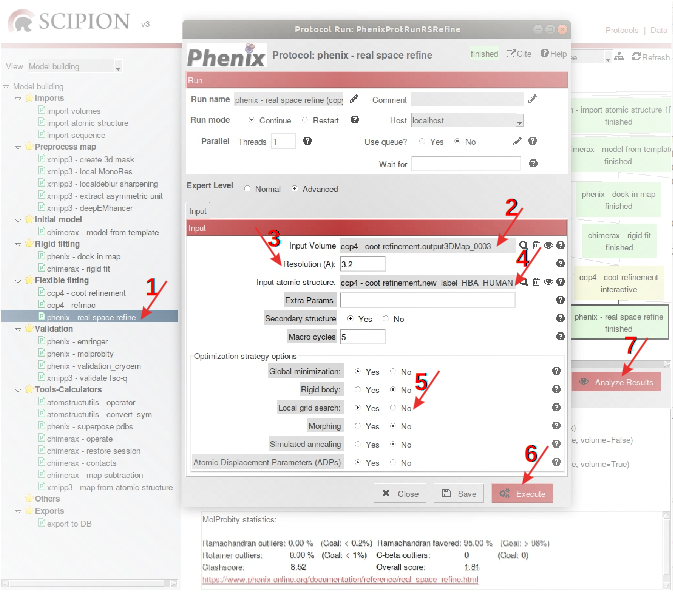

.. _refinementFlexibleFitting:

Refinement: Flexible fitting
============================

Although the rigid fitting approximates *map* and atomic *model*, a detailed visual
inspection of *map* and *model* reveals that some residues are not perfectly fitted.
In order to get a better fit, not only of the carbon skeleton but also
of residue side chains, a flexible fitting or refinement has to be
accomplished. Refinement can thus be defined as the optimization process
of fitting *model* parameters to experimental data. Different strategies,
categorized as refinement in the real space and refinement in the
Fourier space, can be followed. Implemented in *Scipion* are two protocols for
real space refinement, **ccp4-coot refinement** (Appendix :ref:`Coot refinement <app:ccp4CootRefinement>`, :cite:p:`emsley2010`) and **phenix-real space refine** (Appendix :ref:`Real space refine <app:realSpaceRefineProtocol>`, :cite:p:`afonine2018a`), interactive and automatic, respectively,
and one automatic protocol to refine the *model* in the reciprocal space, **ccp4-refmac** 
(Appendix :ref:`Refmac <app:ccp4Refmac>`, :cite:p:`vagin2004`).

Observe the new steps in the modeling *Scipion* workflow in :numref:`model_building_scipion_workflow_flexiblefit`.

.. figure:: Images/Fig68.svg
   :alt: *Scipion* framework detailing the workflow to refine the model of the human *Hgb* :math:`\alpha` subunit in the map asymmetric unit.
   :name: model_building_scipion_workflow_flexiblefit
   :align: center
   :width: 100.0%

   *Scipion* framework detailing the workflow to refine the model of the human *Hgb* :math:`\alpha` subunit in the map asymmetric unit.

CCP4 *Coot* Refinement
---------------

Initially devoted to atomic models obtained by X-ray crystallography
methods, *Coot* (from Crystallopgraphic Object-Oriented Toolkit) is a 3D
computer graphics tool that allows simultaneous display of *map* and fitted *model* to
accomplish mostly interactive modeling operations. Although this
tutorial does not try to show every functionality of *Coot*, but indicate how
to open, close and save partial and final refined structures in *Scipion*, some
of *Coot* basic relevant commands will be shown. Initially, we are going to
refine our *model* with *Coot*. First of all, open the **ccp4-coot refinement** protocol (:numref:`model_building_coot_refinement_protocol` (1)), load the map
asymmetric units (2), with electron density normalized to 1 (*Coot* performs
this step by default), and the fitted structure *model* (3). To
read the protocol Help is recommended. After executing the protocol (4),
the *Coot* graphics window will appear to start working.

.. figure:: Images/Fig24.svg
   :alt: Filling in the *Coot* refinement protocol.
   :name: model_building_coot_refinement_protocol
   :align: center
   :width: 100.0%

   Filling in the *Coot* refinement protocol.

| To check the objects downloaded in *Coot*, go to the second bar of the main
  menu and select *Display Manager*. Maps (numbers *#1*, *#2* and *#3*) and model *Hgb_alpha_Atom_struct__3_007124.cif* (number *#0*) are
  displayed on the left (:numref:`model_building_coot_density_fit_analysis` (A)). Remark that you have buttons to display
  a particular map (1) and to increase or reduce map density scrolling
  it (2). In this case, since we have selected the display of the
  unsharpened map asymmetric unit, we can only observe this *map* together
  with the *model*. If you want to check any of the sharpened maps, select it
  and scroll it. Note that all maps should be aligned. Try to see
  differences in details and connectivity of the map to assess if the
  sharpened maps really optimize the map density compared to the
  unsharpened one. If this is the case, try to follow the refinement
  according to the density of the best map (the most optimized one)
  checking the reliability of the density according to the unsharpened
  map, specially in the most controversial areas. Since you count on
  several sharpening maps you can also take advantage of the different
  map optimizations that you could have in the distinct areas of the
  map.

| To start with the refinement process, we are going to identify the
  part of *model* misfitted to the density map. Visual inspection
  would clarify this point in some cases, although direct observation of
  the *Density fit analysis* might be a shorter way. With this aim, go to the main menu of *Coot*
  graphical window and select *Validate -> Densisty fit analysis*. The density fit will be analyzed
  regarding a specific map. To select any of them, go to the *Coot* right side
  menu (:numref:`model_building_coot_density_fit_analysis` (B)(3)) and open the *Select Map for Fitting* window (C). This density analysis, that
  you can see for the three map asymmetric units in :numref:`model_building_coot_density_fit_analysis` (D) shows that
  residues 1, 51, 73, 138-142 do not fit perfectly to the density map.
  The color range scale varies from green color (good fit) to red color
  (bad fit). There are some differences among maps and, as it was
  expected, the sharpened maps display higher restraints and show
  additional residues partially misfitted.

.. figure:: Images/Fig25.svg
   :alt: A. *Coot Display Manager*. B. *Coot* right side menu. C. *Coot Select Map for Fitting* window. D. Map density fit analysis of the *model* in *Coot* regarding the unsharpened map (upper), :math:`LocalDeblur` sharpened map (middle) and :math:`DeepEMhancer` sharpened map (lower).
   :name: model_building_coot_density_fit_analysis
   :align: center
   :width: 75.0%

   *A*. *Coot Display Manager*. B. *Coot* right side menu. C. *Coot Select Map for Fitting* window. D. Map density fit analysis of the *model* in *Coot* regarding the unsharpened map (upper), :math:`LocalDeblur` sharpened map (middle) and :math:`DeepEMhancer` sharpened map (lower).

According to :numref:`model_building_coot_density_fit_analysis` (B), *MET* residue of the new chain *A* does not fit to the map
density. Maybe this residue has been processed post-translationally, as
we have anticipated in `Input data description <file:///home/marta/software/docs/_build/html/docs/user/tutorials/modelBuilding/030-inputDataDescription.html>`_ section. To solve this
question, go to *Coot* main menu and select *Draw -> Go to Atom... -> Chain A -> A 1 MET* (:numref:`model_building_coot_go_to_atom` (A)). *MET* residue will be located in
the center of *Coot* graphics window. Check if this residue is surrounded by
any electron density. As :numref:`model_building_coot_go_to_atom` (B)(1) shows, no density associates to the
first chain residue. *MET* will thus be deleted. Then go to the lower right
side menu and select the symbol to delete items (B)(2). Select *Residue/Monomer* in the
opened *Delete item* window, and click the *MET* residue that you want to delete. Go again
to *Validate -> Density fit analysis* and check if the orange bar shown in *MET* residue :numref:`model_building_coot_density_fit_analysis` (D) has disappeared.

.. figure:: Images/Fig27.svg
   :alt: Removing post-translationally processed Methionine residue in *Coot*. Note that the icons shown in the image right side may be partially hidden if the screen is small.
   :name: model_building_coot_go_to_atom
   :align: center
   :width: 80.0%

   Removing post-translationally processed Methionine residue in *Coot*. Note that the icons shown in the image right side may be partially hidden if the screen is small.

| Although in this particular example the most interesting
  refinement strategy could be repair only the misfitted residues
  because they are very few, in a more general case, in which we could
  have many misfitted residues, an initial quick refinement may be
  accomplished. With this purpose, first of all, go to the upper right
  side menu (:numref:`model_building_coot_go_to_atom` (B)(3)) and select all four restrictions for *Regularization and Refinement* in the
  respective window of parameters. Secondly, open the *Scipion* browser (:numref:`model_building_cootini` (1)) and
  navigate to the *extra* directory, open the *coot.ini* text file (2), and modify the file
  so it matches the information shown below (3).
::

     [myvars]
     imol: 0
     aa main chain: A
     aa auxiliary chain: AA
     aaNumber: 4
     step: 10

.. figure:: Images/cootini.svg
   :alt: Editing coot.ini file.
   :name: model_building_cootini
   :align: center
   :width: 80.0%

   Editing coot.ini file.

| Finally, go back to *Coot* window and press “U” to initiate global variables
  and “z” to refine the next upstream 10 residues. Go through those
  residues, one by one, and accept refinement if you agree with it. If
  you disagree with the refinement of any residue, perform the
  interactive refinement, visualizing the residue side chain. Repeat the
  refinement process with “z” until the end of the molecule. Check that
  the red bar of residue number 53 (:numref:`model_building_coot_density_fit_analysis`) goes missing at the end of this process.

| After this partially automatic and partially interactive processing,
  go to *Draw -> Go To Atom... -> Chain A -> A 2 VAL (VAL* is now the first residue of the *metHbg* :math:`\alpha` subunit) and start the detailed interactive refinement of the initial residues of
  chain A. To accomplish this interactive refinement of a small group of
  5 to 10 residues, select the blue circle in the upper right side menu
  and click the initial and final residues of the small group of
  residues (:numref:`model_building_coot_go_to_atom` (B)(4)). The group of selected residues gets flexible
  enough to look manually for another spatial distribution. Following
  these instructions, try to solve the misfit that you can find in *TYR* 141
  residue at the end of the molecule. Specifically, try to improve the
  result of the *Validate -> Density fit analysis*, as you can see from (A) to (B) in :numref:`model_building_coot_density_fit_analysis2`, moving *TYR* 141
  ((A)(1)) to the nearest empty map density ((A)(2)). Accept the
  refinement parameters after the displacement of *TYR* ((B)(3)). Finally,
  check the *Density Fit Graph*.

.. figure:: Images/Fig28.svg
   :alt: *Coot* fit in the map density of residue *TYR* 141.
   :name: model_building_coot_density_fit_analysis2
   :align: center
   :width: 85.0%

   *Coot* fit in the map density of residue *TYR* 141.

| Rotamer refinement is another refinement tool available in *Coot*. You can
  try to improve your current *model* modifying rotamers reported
  as incorrect in *Validate -> Rotamer analysis*. Otherwise, the next refinement program in modeling
  workflow (*PHENIX real space refine*) will perform rotamer refinement.

| At the end of this interactive refinement with *Coot*, the refined atomic
  structure has to be saved in *Scipion*. You can save the atomic structure with
  its default name/label by pressing ``w``. If you want to add a special
  label to identify the atomic structure in the *Scipion* workflow you can save
  that label in *Coot* main menu *Calculate -> Scripting -> Python* and the *Coot Python Scripting* window will be opened and you can
  write there your label name, for example *label1_HBA_HUMAN*. This label will appear in
  the *Summary* window of the *Scipion* framework (:numref:`model_building_coot_summary` (A)). Assuming that *#0* is your *model* number,
  write in Command:
::

     scipion write (0, ’label1_HBA_HUMAN’)

.. figure:: Images/Fig26.svg
   :alt: A. *Coot Summary* showing label names of each independent saved atomic structure (1, 3: user’s chosen labels; 2: default label). B. (1, 2, 3) Respective atomic structure file names in the *"extra"* folder.
   :name: model_building_coot_summary
   :align: center
   :width: 85.0%

   *A*. *Coot Summary* showing label names of each independent saved atomic structure (1, 3: user’s chosen labels; 2: default label). B. (1, 2, 3) Respective atomic structure file names in the *"extra"* folder.

| In its interactive way, **ccp4-coot refinement** protocol can be launched again whenever you
  want in *Scipion*, and the last atomic structure saved will be loaded in *Coot*
  graphics window. This functionality of *Scipion* allows to stop the interactive
  refinement and continue the process in the last refinement step,
  maintaining each one of the intermediate refined structures saved in
  order in the *Scipion* tutorial folder */Runs/000XXX_CootRefine/extra* (:numref:`model_building_coot_summary` (B)). Remark that if you want to
  continue with the refinement process you have to select the *Run mode* option *Continue*
  when you edit the *Coot* refinement protocol. In this way, to go again to
  intermediate refined structures is also possible. Finally, when you
  reach the final refined structure, save it, and you may press ``e`` to fully
  stop the *Coot* protocol.

| A similar refinement process to that followed in *Coot* for *metHgb* :math:`\alpha`
  subunit chain *A*, has to be carried out for the *metHgb* :math:`\beta` subunit.

| ``NOTE`` about *chain IDs*: Check the *id* of each chain. Although you have the possibility of
  changing this *id* in *ChimeraX*, as we have seen in the subsection `Structural
  models of human metHgb subunits from templates <file:///home/marta/software/docs/_build/html/docs/user/tutorials/modelBuilding/070-movingFromSequence.html>`_ (*metHgb* :math:`\beta`
  subunit), you also have the possibility of performing this task in *Coot*,
  as it is shown in the next example in which we change the chain *id* from *A*
  to *B*. To change the name of the chain, go to the *Coot* main menu and select
  the option *Edit* (:numref:`model_building_chimerax_asymm_unit_2` (A)(1)) and then *Change chain IDs* and select the current name of the chain *A*
  (:numref:`model_building_chimerax_asymm_unit_2` (B)(2)) by the new one, *B* (3).

.. figure:: Images/Fig74.svg
   :alt: A. *Coot* main menu. B. *Coot* window to change chain IDs.
   :name: model_building_chimerax_asymm_unit_2
   :align: center
   :width: 50.0%

   *A*. *Coot* main menu. B. *Coot* window to change chain IDs.

*PHENIX* Real Space Refine
-----------------

| In order to compare the previous *Coot* interactive refinement with an
  automatic refinement, we are going to use the **phenix-real space refine** protocol in parallel, as
  indicated in :numref:`model_building_scipion_workflow_flexiblefit` (1). In addition, we can assess if the automatic refinement obtained with the protocol **phenix-real space refine** is able to complement and
  improve the result of the *Coot* manual refinement (:numref:`model_building_scipion_workflow_flexiblefit` (2)). Protocol **phenix-real space refine**
  implements in *Scipion* the *phenix.real_space_refine* program developed to address cryo-EM
  structure-refinement requirements. Following a workflow similar to the *PHENIX*
  reciprocal-space refinement program *phenix.refine*, basically devoted to
  crystallography, *phenix.real_space_refine* program, mainly used in cryo-EM, is able to refine in
  real space atomic models against maps, which are the experimental
  data.

| Start working by opening **phenix-real space refine** protocol (:numref:`model_building_phenix_real_space_refine_protocol` (1)), load as input volume the map
  asymmetric unit saved in *Coot* that you consider the most optimized one (2,
  the :math:`deepEMhancer` sharpened map in this case), write the volume
  resolution (3), and load the atomic structure (*model Hgb_alpha_atom_struct_3_007124* in the
  case 1 of :numref:`model_building_scipion_workflow_flexiblefit` or *model new_label_HBA_HUMAN* in the case 2 (4)). After executing the
  protocol (6), results can be checked (7). Try to compare the *MolProbity statistics* that you
  can see in the *Summary* of the *Scipion* framework after changing the *Advanced* parameter *Local grid search* (5) from *Yes*
  to *No* (default value).

   Completing *PHENIX* Real Space Refine protocol (Case 2 of :numref:`model_building_scipion_workflow_flexiblefit`).

The first tab of results shows the initial *model* atomic
structure (:numref:`model_building_phenix_real_space_refine_chimera` (pink)) as well as the refined one (green), both fitted to
the normalized map asymmetric unit saved in *Coot*.

.. figure:: Images/Fig30.svg
   :alt: *ChimeraX* visualization of refined *model* of *metHgb* :math:`\alpha` subunit by *PHENIX* Real Space Refine protocol (Case 2 of :numref:`model_building_scipion_workflow_flexiblefit`).
   :name: model_building_phenix_real_space_refine_chimera
   :align: center
   :width: 65.0%

   *ChimeraX* visualization of refined *model* of *metHgb* :math:`\alpha` subunit by *PHENIX* Real Space Refine protocol (Case 2 of :numref:`model_building_scipion_workflow_flexiblefit`).

| The rest of tabs detail different statistics useful to compare the
  quality of distinct :math:`models` such as :math:`MolProbity`
  statistics and *Real-space* correlations. :math:`MolProbity` results will be
  discussed in the next section of validation and comparison. Regarding *Real-space*
  correlations, different *models* can be compared by using the
  global number of *CC(mask)*, which indicates the correlation *model*-to-*map* calculated considering the map region
  masked around the *model*. You can check also individual
  correlation values for each residue. Remark that residues with lower
  correlation values might be susceptible to improve by additional
  refinement in *Coot*. Have a look to those correlation values in the case 1 of Fig. :numref:`model_building_scipion_workflow_flexiblefit`
  and answer the following questions: (Answers in appendix :ref:`Solutions <app:solutions>`;
  **Question**\ `1 <#refinementFlexibleFitting>`__\ **\ \_1**)

::

   -  What is the *CC(mask)* value?

   -  Which one is the residue that shows the lower correlation value?
      Why?

   -  What is that correlation value?

   -  Which one is the second residue that shows the lower correlation
      value? Why?

   -  What is that correlation value?

   -  What is the correlation value of *HEME* group?

| 
| Now, compare these results with those obtained in the case 2 of , in
  which we have run after . Have the above values of correlation
  changed? (Answer in appendix `[app:solutions] <#app:solutions>`__;
  **Question**\ `1 <#refinementFlexibleFitting>`__\ **\ \_2**)
| The conclusion of this part of refinement in real space is that and
  might perform complementary tasks. The usage of both protocols may
  improve the result, especially when partial processing or big
  rearrangements of molecules are involved.
| Before finishing our refinement workflow with , we can ask ourselves
  how can we improve correlations in real space by modifying the
  parameters in the protocol form. Will the correlation values change if
  we set to “yes” optimization parameters previously set to “no”, and
  increase the number of macro cycles from 5 to 30? Take into account
  that this process takes much more time (around 6 times more) than the
  previous one. (Answer in appendix
  `[app:solutions] <#app:solutions>`__;
  **Question**\ `1 <#refinementFlexibleFitting>`__\ **\ \_3**)
| : An interesting application of the visualization tools is the
  possibility of load from the viewer and correct the structure of
  outliers residues and classhes. A recurively use of and protocols is
  thus possible.

Search Fit
----------

An extension of Real Space Refine is , a protocol implemented in to fit
a small sequence of residues in a certain density of the map and,
afterwards, perform the subsequent refinement in the real space
(Appendix `[app:searchFit] <#app:searchFit>`__). Let us to illustrate
the applicability of this protocol with the workflow described in the .

.. figure:: Images/Fig_search_fit_1.pdf
   :alt: workflow including the protocol.
   :name: fig:phenix_search_fit_1
   :width: 65.0%

   workflow including the protocol.

This example shows a small fraction of residues from the :math:`\alpha`
subunit that was not completely modeled, except for the skeleton of
:math:`\alpha` carbons. The sequence of the chain is perfectly known,
but for certain residues we were unable of tracing the lateral side
chains of those residues and only residues appear in our atomic
structure. A detail of the small fragment of residues can be observed in
the (red arrows). The protocol might help us to replace the residues by
the appropriate aminoacids.

.. figure:: Images/Fig_search_fit_2.pdf
   :alt: Fragment of residues fitted in the human asymmetric unit, as
   can be visualized in the protocol ( (2)).
   :name: fig:phenix_search_fit_2
   :width: 65.0%

   Fragment of residues fitted in the human asymmetric unit, as can be
   visualized in the protocol ( (2)).

As the indicates, the protocol (4) requires three different inputs (1, 2
and 3):

#. Initial map that contains the density of the :math:`\alpha` subunit.
   In this case we use the asymmetric unit map extracted previously
   (section "Extraction of the asymmetric unit map", ).

#. | Small fragment of atomic structure that contains the small chain.
     To create this fragment we start from the published atomic
     structure of the human :math:`\alpha` subunit (included in the
     model of the ID , which can be downloaded from the database using
     the protocol . Next, we use the protocol to isolate the chain of
     the structure. The atomic structure is the only one input of the
     protocol . After the opening of , write in the command line:
   | After saving the chain of the atomic structure , run the protocol
     () to fit the chain from the atomic structure 5NI1 in the
     asymmetric unit map density. Next, open again the protocol protocol
     and, following the previous instructions and the next command
     lines, finish the fitting, mutate the sequence between residues 94
     and 118 to generate the chain, and finally save the small mutated
     fragment:

#. Sequence of the :math:`\alpha` subunit imported previously in section
   “Sequences” ().

With these three previous inputs we can complete the protocol form ().
Open it in the left menu (1) and include the asymmetric unit map (2)
detailing its resolution (3), as well as the small fragment of mutated
structure previously saved (4), the sequence downloaded (5) and take
advantage of the two wizards on the right (6 and 7) to select the
initial and final residues that delimite the sequence to search.

.. figure:: Images/Fig_search_fit_3.pdf
   :alt: Completing the protocol in .
   :name: fig:phenix_search_fit_3
   :width: 95.0%

   Completing the protocol in .

After executing the protocol ((8)) we can have a look to the results. By
pressing ((9)) a window with the Viewer menu is opened ((A)). This menu
allows to visualize a certain number of atomic structures, according to
their ranking scores, with lateral side chains fitted in the map density
(1). Those structures will be opened in (2) surrounded by the density
located at 3.0Å of the structure (3). The number shown by default in (1)
allows displaying all atomic structures. By pressing (4) a pop up window
will open and show the score values of each structure, as well as the
average and standard deviation of those values ((B)). If we select the
visualization of a certain number of atomic structures, 5 for example,
as points the red arrow in ((C)), the five best score values will appear
remarked in red in the Summary Plot.

.. figure:: Images/Fig_search_fit_4.pdf
   :alt: Visualization of protocol results in . A. Results menu. B.
   Map-model fit score plot (total number of atomic structures). C.
   Upper part of the Map-model fit score plot (5 best atomic
   structures). D. Model panel in showing the 5 best atomic structures
   selected. E. Models 3 to 8 displayed inside the map density. F.
   Models and . G. Model compared with the same fragment of the atomic
   structure .
   :name: fig:phenix_search_fit_4
   :width: 85.0%

   Visualization of protocol results in . A. Results menu. B. Map-model
   fit score plot (total number of atomic structures). C. Upper part of
   the Map-model fit score plot (5 best atomic structures). D. Model
   panel in showing the 5 best atomic structures selected. E. Models 3
   to 8 displayed inside the map density. F. Models and . G. Model
   compared with the same fragment of the atomic structure .

| Panel D of the shows the model panel with the five best selected
  structures, , , , and . The red arrow points the position of these
  indexes. The respective score values are observed in red in (C). (E)
  details the view of the five structures in the GUI of (models to ), as
  well as the input fragment of ALA (model ). Remark that lateral side
  chains are not shown by default. (F) compares this input model with
  the best score structure (model ). To display the lateral side chains
  select each model and press “Show” in “Atoms” section of the toolbar.
  In the same way, (F) compares this input model with the respective
  fragment of the structure. To open it as model and align it with the
  rest of the structures, write in the comand line:
| In spite of some small differences, most of lateral side chains align
  quite well with the ones of the model traced on the experimental map.
  Then, the best approximation of the atomic structure retrieved (model
  ) can be selected to help with the tracing of a small fraction of the
  density map since the model seems to be quite close to the actual
  atomic structure used as control ().

 
-

As in the case of , (from maximum-likelihood Refinement of
Macromolecules) was initially developed to optimize models obtained by
X-ray crystallography methods but, unlike , automatically and in
reciprocal space. The :math:`models` refined in the real space with and
, successively, will be used as inputs to perform a second refinement
step in the Fourier space with protocol . Firstly, open the protocol
form ( (1)), load the volume generated by (2), the atomic structure
obtained with (case 3 of ) (3) or with after (case 4 of ), and the
volume resolution as maximum resolution (4). Execute the protocol (5)
and when it finishes, analyze the results (6).

.. figure:: Images/Fig31.pdf
   :alt: Filling in protocol (Case 3 of ).
   :name: fig:refmac_protocol
   :width: 100.0%

   Filling in protocol (Case 3 of ).

Clicking the first item in the display menu of results ( (1)), graphics
window will be opened showing the input volume, the initial
:math:`model` ( obtained with (, pink), and the final refined
:math:`model` (, green). By clicking the third item in the display menu
of results ( (2)), a summary of results are shown. Check if values of
and have improved with this refinement process in these three cases:

-  | Running after :
   | Can you see an improvement running immediately after , thus
     ignoring :math:`model` improvements generated by ? (Answers in
     appendix `[app:solutions] <#app:solutions>`__;
     **Question**\ `1 <#refinementFlexibleFitting>`__\ **\ \_4**)

-  | Running after after :
   | Why the improvement seems to be very small? (Answers in appendix
     `[app:solutions] <#app:solutions>`__;
     **Question**\ `1 <#refinementFlexibleFitting>`__\ **\ \_5**)

-  | Running after without a mask:
   | Compare previous results (after and ) with those obtained selecting
     the option in the protocol form parameter . Use two different
     volumes, the one generated by protocol, and the one generated by
     the protocol. Are there any differences? Why? (Answers in appendix
     `[app:solutions] <#app:solutions>`__;
     **Question**\ `1 <#refinementFlexibleFitting>`__\ **\ \_6**)

.. figure:: Images/Fig32.pdf
   :alt: Display menu of results.
   :name: fig:refmac_display_results
   :width: 65.0%

   Display menu of results.

.. figure:: Images/Fig33.pdf
   :alt: visualization of refined :math:`model` of :math:`\alpha`
   subunit by (Case 3 of ).
   :name: fig:refmac_chimera
   :width: 50.0%

   visualization of refined :math:`model` of :math:`\alpha` subunit by
   (Case 3 of ).

Have a look to the rest of items in the display window of results.

The best refinement workflow
----------------------------

At this point we wonder about the optimal steps to follow in the
refinement process. Should we have to use first, then , then ?, or
maybe, with a different and , should we start with the automatic
refinement and then go to the manual one? The right answer is that there
is no a unique answer. The strategies and the number of steps of
refinement might differ and the only requirement is that the next step
in refinement should generate a better structure than the previous one.
This premise requires to apply common validation criteria to assess the
progressive improvement of our .
