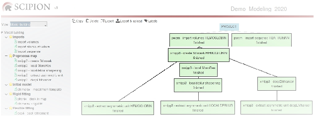
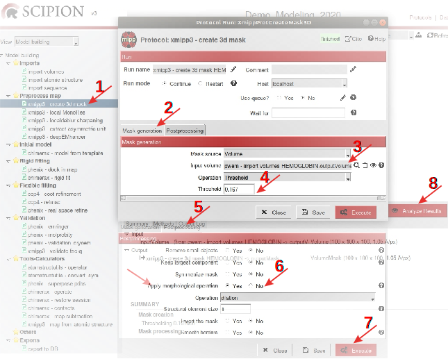
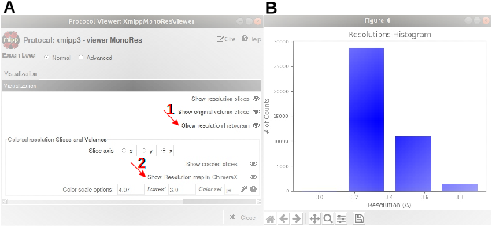
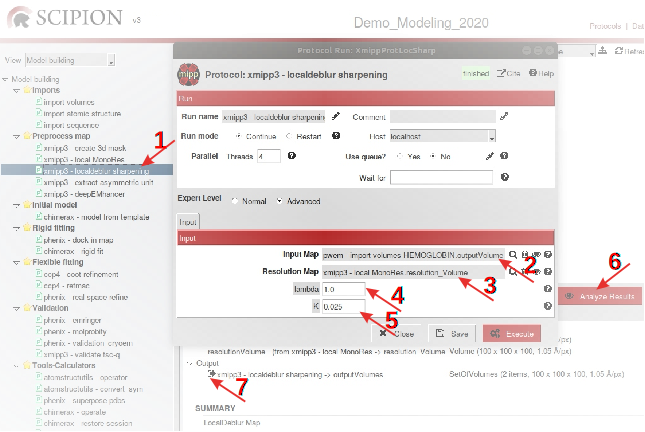
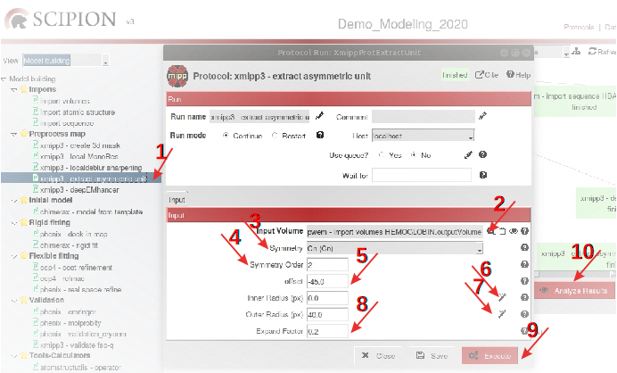

3D Map preprocessing
====================

The :numref:`model_building_scipion_workflow_import_2` shows the workflow that we are going to detail in this section.

   *Scipion* framework detailing the workflow generated after 3D map preprocessing.

Map sharpening
--------------

| As we have indicated before, since map sharpening contributes to
  increase signal at medium/high resolution, we recommend to perform
  this map preprocessing step before tracing the atomic model of cryo-EM
  3D maps :cite:p:`ramirez2018`. To accomplish this task, a
  couple of automatic alternatives are available in *Scipion*: 1) local
  sharpening method independent of initial model, based on local
  resolution estimation (:cite:p:`ramirez2018` (Appendix :ref:`Local Deblur Sharpening <app:localDeblurSharpening>`)), 2)
  deep learning-based sharpening approach (:cite:p:`Sanchez-Garcia2020.06.12.148296` (Appendix
  :ref:`DeepEMhancer Sharpening <app:deepEMhancerSharpening>`)).
  Although both sharpening methods display good results, these are not
  identical but complementary since *LocalDeblur* maximizes
  specially details like the secondary structure, whereas
  *DeepEMhancer* maximizes connectivity, favoring the fair tracing
  of the molecule skeleton.

| Although the common first rule in both sharpening strategies is
  counting on half maps to get the best performance of the methods, or
  the average raw map otherwise, exceptionally in this case, to
  illustrate the procedure we are going to use the final postprocessed
  map deposited in the database, where no half maps have been submitted
  together with the final map.

Sharpening with :math:`LocalDeblur`
~~~~~~~~~~~~~~~~~~~~~~~~~~~~~~~~~~~~~~

| Since :math:`LocalDeblur` takes advantage of map local resolution to
  increase the signal, we have to compute this local resolution as first
  step to apply the :math:`LocalDeblur` sharpening method. Although
  different algorithms could be used to compute local resolution, we
  have selected :math:`MonoRes` :cite:p:`vilas2018`,
  implemented in in the protocol **xmipp-local MonoRes** (Appendix :ref:`Local MonoRes <app_localMonoRes>`).

| Since a map binary mask has optionally to be included as a parameter
  in this protocol, we will build a mask by using the *Scipion* protocol **xmipp-create 3d mask** (Appendix :ref:`Create 3D mask <app:create3DMask>`) as starting step in the
  local resolution estimation process. Open the protocol form (:numref:`model_building_create3Dmask_1` (1)) and
  fill in the tap *Mask generation* (2) with the input volume (3) and the density
  threshold (4). By default, the level value observed in *ChimeraX* main graphics
  window (:numref:`model_building_visualization_volume`) *Tools →  Volume Data → Volume Viewer → Level* can be selected as threshold. In the *Postprocessing* tap (:numref:`model_building_create3Dmask_1` (5)), select *Yes* in *Apply morphological operation* (6) and maintain the rest of options by default. After executing this
  protocol (:numref:`model_building_create3Dmask_1` (7)), the morphology of the mask generated can be checked
  in slices by clicking *Analyze Results* (8).

   Filling in the protocol to create a mask of the initial volume.

:math:`ShowJ`, the default viewer, allows visualize the mask with shape
similar to the starting volume (:numref:`model_building_create3Dmask_2`).

.. figure:: Images/Fig54.svg
   :alt: Visualizing the mask of the initial volume.
   :name: model_building_create3Dmask_2
   :align: center
   :width: 60.0%

   Visualizing the mask of the initial volume.

.. note:: In case you would like to use a previous computed mask, you can do it simply by importing it using the protocol **import mask** (Appendix :ref:`Import mask <app:importMask>`).

| Once the mask of the starting map has been created, the protocol of **xmipp-local MonoRes** 
  can be completed to get the estimation of local resolution. Open the
  protocol (:numref:`model_building_localMonoRes_1` (1)) and include the starting map (2), as well as the
  binary mask (3). Finally, based on the map resolution (3.2 Å), select
  the default resolution range between *0.0* and *6.0* Å (4).

.. figure:: Images/Fig55.svg
   :alt: Completing the protocol to estimate the local resolution of the map.
   :name: model_building_localMonoRes_1
   :align: center
   :width: 100.0%

   Completing the protocol to estimate the local resolution of the *metHgb* map.

Execute this protocol (:numref:`model_building_localMonoRes_1` (5)) and analyze the results (6). The menu of
results (:numref:`model_building_localMonoRes_2` (A)), among other views, shows the histogram of local
resolutions (1) and the resolution map in (2). The histogram of
resolutions, which displays the number of map voxels showing a certain
resolution, allows to conclude that the majority of voxels evidence a
resolution between 3.2 and 3.5 Å, quite close to the published map
resolution (3.2 Å). The resolution map shown by *ChimeraX* details the resolution of
each voxel (:numref:`model_building_localMonoRes_3`). The bar on the left indicates the color code for
resolution values.

   **xmipp3-local MonoRes** menu of results (A) and histogram of resolutions (B).

.. figure:: Images/Fig57.svg
   :alt: Resolution map in *ChimeraX*.
   :name: model_building_localMonoRes_3
   :align: center
   :width: 70.0%

   Resolution map in *ChimeraX*.

Local resolution values of the input map allow to compute the sharpened
map by the **xmipp3-localdeblur sharpening** protocol, which implements an iterative step descending
method that doesn't require initial model. To run this method, open
the protocol (:numref:`model_building_localdeblur_1` (1)) and include the starting map (2) and the map of
resolution values (3), maintaining the default values for the rest of
parameters (4, 5).

   Filling in the protocol to compute the sharpened map.

After two iterations, the sharpening algorithm reached the convergence
criterion, *i.e.* a difference between two successive iterations
lower than 1%, and stopped. The two maps obtained in the respective
iterations can be observed with :math:`ShowJ` by clicking the black
arrow shown in :numref:`model_building_localdeblur_1` (7) with the right mouse botton and selecting *Open with DataViewer*. Resulting
map for each iteration will be shown, as indicated in :numref:`model_building_localdeblur_2`. Visualization in *ChimeraX* is also possible selecting *Open* in the menu option *File* (:numref:`model_building_localdeblur_2` (1)).

.. figure:: Images/Fig59.svg
   :alt: Sharpened maps generated after two iterations.
   :name: model_building_localdeblur_2
   :align: center
   :width: 65.0%

   Sharpened maps generated after two iterations.

Additionally, by clicking *Analyze Results* (:numref:`model_building_localdeblur_1` (6)) the sharpened map obtained after the
second iteration, *i.e.* the *last* map, can be also visualized and
compared with the initial one in *ChimeraX* (:numref:`model_building_localdeblur_3`).

.. figure:: Images/Fig64.svg
   :alt: :math:`LocalDeblur` iteration sharpened map (yellow surface) and input map (grey mesh) in .
   :name: model_building_localdeblur_3
   :align: center
   :width: 65.0%

   :math:`LocalDeblur` *last* iteration sharpened map (yellow surface) and
   input map (grey mesh) in *ChimeraX*.

Sharpening with :math:`DeepEMhancer`
~~~~~~~~~~~~~~~~~~~~~~~~~~~~~~~~~~~~~~~

:math:`DeepEMhancer` is an alternative automatic sharpening method based
on deep learning :cite:p:`Sanchez-Garcia2020.06.12.148296`, implemented in *Scipion* in the protocol **xmipp3-deepEMhancer** (Appendix :ref:`DeepEMhancer Sharpening <app:deepEMhancerSharpening>`). Open
this protocol (:numref:`model_building_deepEMHancer_1` (1)) and complete it as indicated. Since only the
refined map is available, we are not going to use half maps (2). Include
your map (3), the type of normalization desired (4) and the deep
learning mode to use (5), in this particular case *highRes* due to the map high
resolution.

.. figure:: Images/Fig63.svg
   :alt: Filling in the protocol to generate a sharpened map with :math:`DeepEMhancer`.
   :name: model_building_deepEMHancer_1
   :align: center
   :width: 95.0%

   Filling in the protocol to generate a sharpened map with :math:`DeepEMhancer`.

After executing the protocol (:numref:`model_building_deepEMHancer_1` (6)), we can check the results (7). *ChimeraX* viewer will open and show the sharpened map compared with the initial
one (:numref:`model_building_deepEMHancer_2`).

.. figure:: Images/Fig65.svg
   :alt: :math:`DeepEMhancer` sharpened map (yellow surface) and input map (grey mesh) in *ChimeraX*.
   :name: model_building_deepEMHancer_2
   :align: center
   :width: 65.0%

   :math:`DeepEMhancer` sharpened map (yellow surface) and input map
   (grey mesh) in *ChimeraX*.

Comparison of maps
------------------

Realize that at this point we have generated two optimized maps derived
from the initial one. Additionally, some other maps could have been
obtained using other map optimization methods. A comparison among them
would be interesting to consider which one(s) of them should be used as
input in next steps of modeling workflow. The ideal map for tracing the
atomic structure should include as many details and connections as
possible and, at the same time, preserve the density areas of the
initial map. In other words, we can use the best sharpened map (with
higher resolution) corroborating that it does not make up new densities,
absent in the starting map. Nevertheless, selecting “the best” sharpened
map could be difficult sometimes, especially if the map is very big or
there are some regions optimized in one of the sharpened maps and other
areas optimized in the other one. In that case, you can use several maps
at the same time, having all of them perfectly aligned according to the
same origin of coordinates.

In the tiny example shown in this tutorial we are working with a high
resolution map and there are almost no differences in resolution between
the starting map and the two derived sharpened maps, although this is
not usually the case in real life. In this quite uncommon case the
initial unsharpened map would be enough to trace the atomic structure.
However, in order to detail the method, the starting map and their two
sharpened ones will be used simultaneously.

.. _`section_extraction_asym_unit`:

Extraction of the asymmetric unit map
-------------------------------------

| Since smaller volumes usually include lower number of individual
  structural elements, making easier fitting models in maps and
  simplifying modeling process, the part of the map chosen to work with
  will always be the smaller asymmetrical subunit of the starting loaded
  map, also known as asymmetric unit (ASU). The size of the ASU thus
  depends on the symmetry order of the initial volume. The higher the
  symmetry order, the smaller the ASU. The atomic structure of the whole
  volume will be obtained straight forward by simply repetition of the
  ASU structure according to the symmetry order. Then, the first step to
  simplify the complexity of the initial volume is extracting the ASU.
  This task can be accomplished by using the *Scipion* protocol **xmipp3-extract unit cell** that extracts the
  geometrical ASU of the map (Appendix :ref:`Extract unit cell <app:extractUnitCell>`).

| :numref:`model_building_extract_unit_cell` shows how to fill in this protocol form (1). Consider that in this
  particular case the protocol will be run three times, one with each
  map (the initial one and the two sharpened derived ones). Include each
  map in a protocol form parallel to that shown in :numref:`model_building_extract_unit_cell` (2). Since *metHgb* 
  macromolecule shows symmetry C2, we have selected cyclic symmetry (Cn)
  as type of symmetry (3), and 2 as symmetry order (4). The angle offset
  selected (5) turns -45º around the Z axis the mask used to create the
  ASU. The two wizards on the right (6, 7) help you to select the radii
  to delimit a fraction of the map comprised between the coordinate
  origin (inner radius 0.0) and the maximum radius (outer radius 50.0).
  The final extracted volume will be slightly higher than the ASU due to
  the expand factor 0.2 (8). The respective tutorial appendix :ref:`Extract unit cell <app:extractUnitCell>`
  includes a comprehensive explanation of the meaning of parameters.

   Extracting the map asymmetric unit (ASU).

After executing the protocol (:numref:`model_building_extract_unit_cell` (9)), the resulting expanded ASU can be
observed (10) with *ChimeraX* (:numref:`model_building_chimera_visualization_unit_cell`). Note the additional expanded volume of the ASU on the left side of the figure. The ASU itself, on the right side,
constitutes the half volume. Since the total volume contains the
structure of four proteins, we can anticipate that this smaller
asymmetrical subunit of the initial volume contains two proteins, one
:math:`\alpha` and one :math:`\beta` subunit. Then, the respective
structures of these two proteins could be fitted in the map ASU
simultaneously or in successive modeling workflow steps.

.. figure:: Images/Fig8.svg
   :alt: Expanded ASU (yellow-green-blue) and initial volume (gray) visualized with :math:`ChimeraX`. The purple broken line on the right delimits the ASU (right) and its expanded volume (left).
   :name: model_building_chimera_visualization_unit_cell    
   :align: center
   :width: 80.0%

   Expanded ASU (yellow-green-blue) and initial volume (gray) visualized
   with :math:`ChimeraX`. The purple broken line delimits
   the ASU (right) and the expanded volume (left).
