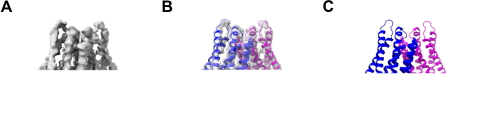

.. _problemToSolveTACAN:

Problem to solve: Human ion channel TACAN isoform induced by tumor necrosis factor alpha 
========================================================================================

The transmembrane protein TMEM120A, also known as TACAN isoform 1, forms an ion channel involved in adipocite differentiation and in sensing mechanical pain in animals and plants. 
The structure of the homodimer purified or reconstituted in lipid nanodiscs has been modeled from cryo-EM data :cite:p:`rong2021`, :cite:p:`xue2021`, :cite:p:`chen2022`. Map and atomic structure of this homodimer, unbound to any ligands is shown in :numref:`model_building_TACAN_figure`. The complex displays C2 symmetry and shape of seesaw rocker. Each protomer is a relativelly small protein of 343 amino acids. The soluble N-terminal domain of each protein is located in the cytosolic side (horizontal helices in :numref:`model_building_TACAN_figure`), and the transmembrane domain is embedded in the lipid bilayer (vertical helices in :numref:`model_building_TACAN_figure`). Each protomer contains a pore putatively devoted to ion transport that seems to be closed at resting state :cite:p:`chen2022`. Although different ligands have been identified bound to the dimer complex, such as the fatty acid metabolism cofactor CoASH, which occupies a small density in the intracellular funnel-like cavity of each monomer :cite:p:`rong2021`, :cite:p:`xue2021`, or cholesterol molecules at the flanks of the two protomers :cite:p:`chen2022`, they seem to dissociate using a detergent solution that allows to get the homodimer unbound to any ligands :cite:p:`rong2021`.

   Map (**A**) , model fit to map (**B**) and model (**C**) of the human TACAN homodimer (isoform 1).

The volume of the first isoform of human TACAN complex, at 4 Å resolution, and its atomic interpretation
(:numref:`model_building_TACAN_figure`) are available in the Electron Microscopy Data Bank (*EMDB*) and Protein
Data Bank (*PDB*) with accession numbers `EMD-31441 <https://www.ebi.ac.uk/emdb/EMD-31441>`_  and `PDB 7F3U <https://www.rcsb.org/structure/7F3U>`_, respectively. 

This tutorial will guide us in the model building of TACAN isoform 1 atomic structure using `model-angelo <https://github.com/3dem/model-angelo>`_ :cite:p:`jamali2023modelangelo`
in the *Scipion* framework. We are going to use the 3D map `EMD-31441 <https://www.ebi.ac.uk/emdb/EMD-31441>`_ as starting input, with and without the protein sequence (`UniProtKB ID Q9BXJ8 <https://www.uniprot.org/uniprot/Q9BXJ8>`_).
We will finish with the comparison among the models generated and the atomic structure already traced (`PDB 7F3U <https://www.rcsb.org/structure/7F3U>`_).

