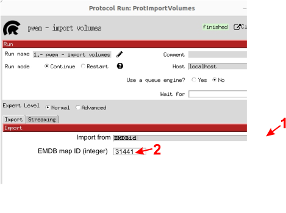
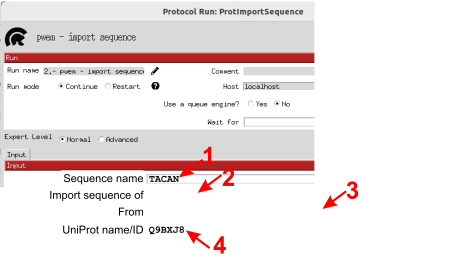
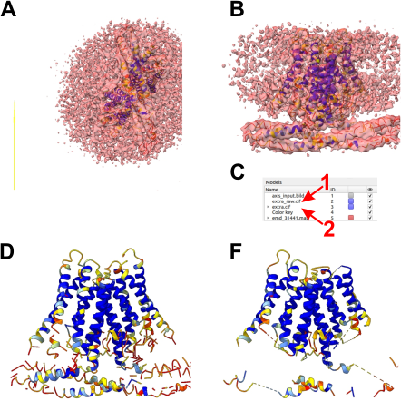
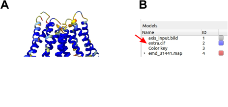

.. _`getInitialModel`:

Get the initial model with ModelAngelo
=====================================

In this section of the Modelangelo tutorial we cover steps 1, 2, 3 and 4 of the small workflow shown before (:numref:`model_building_fig1_workflow`) addressed 
to get Modelangelo prediction structures of the human TACAN protein (isoform 1).

ModelAngelo is able to predict the atomic structure of a 3D-EM map with or without protein sequences :cite:p:`jamali2023modelangelo`. We are going to predict the tracing of the human TACAN protein in both cases, 
a) using the protein sequence, and b) in absence of any protein sequence.

Modelangelo initial model using 3D map and protein sequence as starting inputs
------------------------------------------------------------------------------

As described in :ref:`Import Input Data <importInputData>` section, we are going to take advantage of *Scipion* software framework to import 
the 3D map and the sequence of the human TACAN protein isoform 1 using protocols **import volumes** and **import sequence**. Details about the parameters
of these two protocols are shown in Appendices :ref:`Import volumes <app:importVolume>` and :ref:`Import sequence <app:importSequence>`, respectively.

First open the **import volumes** protocol (:numref:`model_building_modelangelo_import_volume`), fill in the form selecting EMDBid (1) to 
import the map from the database, and include the ID number for the TACAN homodimer (2). Finally, execute the protocol.

   Importing the volume in *Scipion* (workflow step 1; :numref:`model_building_modelangelo_fig1_workflow`).

Then you may visualize the volume with *ChimeraX* :cite:p:`Goddard2018` clicking **Analyze Results**. The 3D map of the TACAN homodimer 
(:numref:`model_building_TACAN_figure`, A) appears inserted in the lipid nanodisc on the right side of the coordinate axes.

The sequence of the human TACAN protein isoform 1 will be downloaded from `UniprotKB <https://www.uniprot.org>`_. First of all, 
open the form of **import sequence** protocol (:numref:`model_building_modelangelo_import_sequence`), then complete the form to download 
TACAN (1) aminoacid sequence (2) with *UniprotKB* (3) accession code `Q9BXJ8 <https://www.uniprot.org/uniprot/Q9BXJ8>`_.
Execute the process and visualize the sequence in a text editor. The sequence will appear in *fasta* format. 

   Importing a sequence in *Scipion* (workflow step 2; :numref:`model_building_modelangelo_fig1_workflow`).

Once we have map and sequence we can run **modelangelo - model builder** protocol (:numref:`model_building_modelangelo_prediction`). Details about the parameters
of this protocol are shown in Appendix :ref:`ModelAngelo <app:modelAngeloPredictionProtocol>`. Complete the form selecting the GPU 
that you plan to use (1), the 3D map (2) and the *UniprotKB* sequence (3) of the TACAN protein. Finally, execute the process. 

.. figure:: Images/Fig4_modelangelo.svg
   :alt: Completing the *Scipion* protocol **modelangelo - model builder** to predict the atomic structure of TACAN protein, 
    isoform 1 (workflow step 3; :numref:`model_building_modelangelo_fig1_workflow`).
   :name: model_building_modelangelo_prediction
   :align: center
   :width: 95.0%

   Completing the *Scipion* protocol **modelangelo - model builder** to predict the atomic structure of TACAN protein, 
   isoform 1 (workflow step 3; :numref:`model_building_modelangelo_fig1_workflow`).

Then, we can visualize the predicted atomic structure based on the 3D map clicking **Analyze Results**. *ChimeraX* 
:cite:p:`Goddard2018` viewer will open by default (:numref:`model_building_modelangelo_results_1`, A). 

    human TACAN protein as it appears in *ChimeraX* GUI main window showing the b-factor value for each atom colored according 
    AlphaFold prediction criteria. **B**: *Idem*, frontal view.  **C**, Models panel. Arrows highlight raw prediction model (1), detailed 
    in **D**, and final postprocessed pruned model (2) detailed in **E**.
   :name: model_building_modelangelo_results_1
   :align: center
   :width: 95.0%

   Prediction of TACAN protein (isoform 1) structure obtained using *ModelAngelo* with 3D map and sequence as inputs. **A**: Upper view of the homodimer of the 
   human TACAN protein as it appears in *ChimeraX* GUI main window showing the b-factor value for each atom colored according 
   AlphaFold prediction criteria. **B**: *Idem*, frontal view.  **C**, Models panel. Arrows highlight raw prediction model (1), detailed 
   in **D**, and final postprocessed pruned model (2) detailed in **E**.

As you can see (:numref:`model_building_modelangelo_results_1`), parts of the predicted raw model (D) have been removed in the pruned one (F).
These removed portions do not have good matches to the sequence based on a hidden Markov model alignment :cite:p:`jamali2023modelangelo`.
You can observe the sequences included both in the raw and the pruned predictions simply by clicking in the upper menu of *ChimeraX* GUI -> *Tools*
-> *Sequence* -> *Show Sequence Viewer*, and a window similar to shown in :numref:`model_building_modelangelo_results_2` (A) 
will display all sequences.

.. figure:: Images/Fig6_modelangelo_results_2.svg
   :alt: Sequence fragments from the UniProtKB ID Q9BXJ8 traced in the 3D map. **A**:
    *ChimeraX* selection sequence panel. Pruned prediction sequences appear in the lower blue shadow of the panel. **B**: Clustal Omega alignment 
    highlighting matching residues of sequences of the pruned prediction and the whole sequence of the UniProtKB protein Q9BXJ8.
   :name: model_building_modelangelo_results_2
   :align: center
   :width: 100.0%

   Sequence fragments from the UniProtKB ID Q9BXJ8 traced in the 3D map. **A**:
   *ChimeraX* selection sequence panel. Pruned prediction sequences appear in the lower blue shadow of the panel. **B**: Clustal Omega alignment 
   highlighting matching residues of sequences of the pruned prediction and the whole sequence of the UniProtKB protein Q9BXJ8.

As observed in :numref:`model_building_modelangelo_results_2` (B), sequences Ad and Ae, with a higher number of residues (104 and 155, respectively), 
contribute the most to the final pruned prediction. In this example, 74% of the whole Q9BXJ8 protein sequence has been covered by the pruned 
prediction. The rest of the map, containing regions with lower resolution, has to be modeled manually.

Modelangelo initial model using only the 3D map as starting input
-----------------------------------------------------------------

We are going to start this example running again the **modelangelo - model builder** protocol. 
As we have seen above (:numref:`model_building_modelangelo_prediction`), this time we have to complete the form selecting the GPU 
that you plan to use (1) and the 3D map (2), to finally, execute the process. 

After executing the protocol, we can visualize the results in a similar way as we have done before. Clicking **Analyze Results**, *ChimeraX* 
:cite:p:`Goddard2018` viewer will open by default (:numref:`model_building_modelangelo_results_3`). 

    Atomic structure generated. **B**: Models panel. Arrow highlights the unique prediction model generated.
   :name: model_building_modelangelo_results_3
   :align: center
   :width: 95.0%

   Prediction of TACAN protein (isoform 1) structure obtained using *ModelAngelo* with only the 3D map as input. **A**: 
   Atomic structure generated. **B**: Models panel. Arrow highlights the unique prediction model generated.

Although the prediction (:numref:`model_building_modelangelo_results_3`, A) is aparently similar to the previous one (:numref:`model_building_modelangelo_results_1`, D),
some differences can be observed between the results displayed. First of all, only one prediction has been generated (B, red arrow).  
This unique prediction is similar to the raw prediction obtained when the sequence is included as input also. Postprocessing or pruning depends 
on the sequence matching. Then, the pruned structure thus cannot be generated. In addition, the whole structure is constituted by a high number 
of small fragments that have to be manually assessed. The goodness of this prediction of sequence and structure will depend on the map resolution. 
The better the resolution, the higher number of residues could be inequivocally assigned to the map density. Since the map `EMD-31441 <https://www.ebi.ac.uk/emdb/EMD-31441>`_  
has already been traced (`PDB 7F3U <https://www.rcsb.org/structure/7F3U>`_), we can compare the published structure with our ModelAngelo prediction
(:numref:`model_building_modelangelo_results_4`) in the background of the map density.

   .. figure:: Images/Fig8_modelangelo_results_4.svg
      :alt: Comparison of PDB ID 7F3U atomic structure (chain A, residues 217-235, blue) with ModelAngelo prediction (chain Af, residues 315-334, pink).
       EMDB ID 31441 map density in grey.
      :name: model_building_modelangelo_results_4
      :align: center
      :width: 50.0%

      Comparison of PDB ID 7F3U atomic structure (chain A, residues 217-235, blue) with ModelAngelo prediction (chain Af, residues 315-334, pink).
      EMDB ID 31441 map density in grey.

Red arrows in :numref:`model_building_modelangelo_results_4` point to three Phenylalanine residues located in the `Q9BXJ8 <https://www.uniprot.org/uniprot/Q9BXJ8>`_ sequence 
217-QK **F** RNQ **F** LSFSMYQS **F** VQF-235 that have been correctly assigned. In general, residues with big lateral side chains are better assigned than others and they can be a good starting point 
to assign the rest of the sequence residues.

